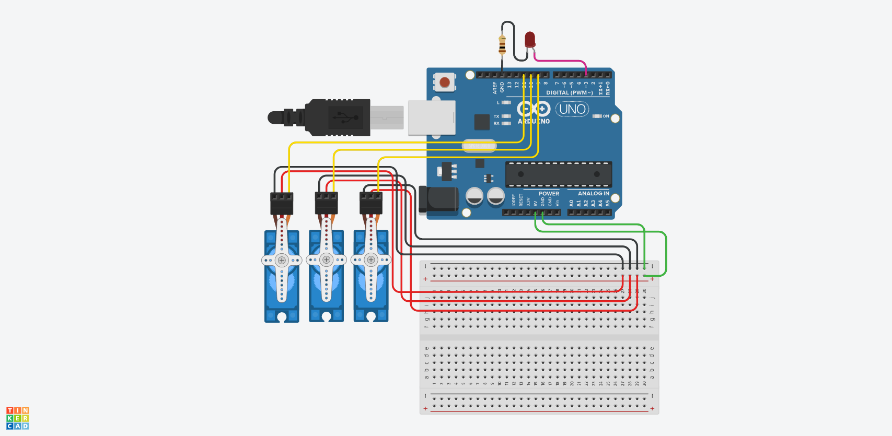

# Hand-Controlled Smart Lamp with MediaPipe

This project demonstrates a hand-controlled smart lamp, powered by Arduino and MediaPipe Hands. The lamp is designed with three motorized axes (base, arm, and head) for precise positioning and includes functionality to adjust the brightness of the light using hand gestures.

---

## Table of Contents

- [Features](#features)
- [Hardware Requirements](#hardware-requirements)
- [Software Requirements](#software-requirements)
- [Installation](#installation)
- [How It Works](#how-it-works)
- [3D Printed Parts](#3d-printed-parts)
- [Circuit Design](#circuit-design)
- [Usage](#usage)
- [Future Improvements](#future-improvements)
- [Acknowledgments](#acknowledgments)

---

## Features

- **Hand Gestures**: Adjust the lamp's light intensity and control its base, arm, and head positions.
- **3 Degrees of Motion**: The lamp can rotate and move along three axes.
- **Brightness Control**: Use hand gestures to dim or brighten the light.
- **Gesture Detection**: Implemented using MediaPipe for smooth and accurate hand tracking.

---

## Hardware Requirements

- Arduino Board
- 3 Servo Motors
- LED Lights/LED Diodes
- 100 Ohm Resistor
- Jumper Wires
- Webcam (for gesture detection)

---

## Software Requirements

- Python 3.x
- OpenCV
- MediaPipe
- Arduino IDE

---

## Installation

1. **Clone the Repository**:
   ```bash
   git clone https://github.com/your-repo-name/hand-controlled-lamp.git
2. **Install Dependencies**:
   ```bash
   pip install opencv-python mediapipe
3. **Upload the Arduino Sketch**:
   - Open the Sweep.ino file in Arduino IDE.
   - Connect your Arduino and upload the code.
   - Run the Python Script:
   ```bash
   python mediapipe_hands_control.py

---

## How It Works

1. **Hand Tracking**: The webcam captures hand gestures processed by MediaPipe Hands.
2. **Gesture Mapping**:
   - **Base Control**: Move the fist left or right and maintain in right and left area of camera.
   - **Arm Control**: Raise/lower fist and maintain in the upper/lower area of camera.
   - **Head Control**: Raise/lower open palm and maintain in the upper/lower area of camera.
   - **Light Intensity**: Adjust by spreading thumb and pinky.
3. **Arduino Commands**: Commands are sent to the Arduino over serial communication to control the servos and LED brightness.

---

## 3D Printed Parts

This project includes several custom 3D-printed parts for the lamp's structure:
- Base
- Lamp Arm Connector
- Lamp Head
- Cellular Connector
- Lamp Cover
- Full Lamp Model
- Circuit Design
The circuit includes an Arduino board, servos, and an LED setup. Refer to the diagram below:


---

## Usage

1. **Connect Hardware**: Assemble the lamp and connect all components as per the circuit diagram.
2. **Run Gesture Detection**: Start the Python script to enable hand tracking.
3. **Control the Lamp**:
   - Rotate or tilt the lamp by moving your hand.
   - Adjust brightness with thumb and pinky gestures.

---

## Future Improvements

- **Add Voice Control**: Integrate voice commands using speech recognition.
- **Improve Detection**: Enhance gesture recognition for more commands.
- **Wireless Control**: Replace serial communication with Bluetooth or Wi-Fi.
